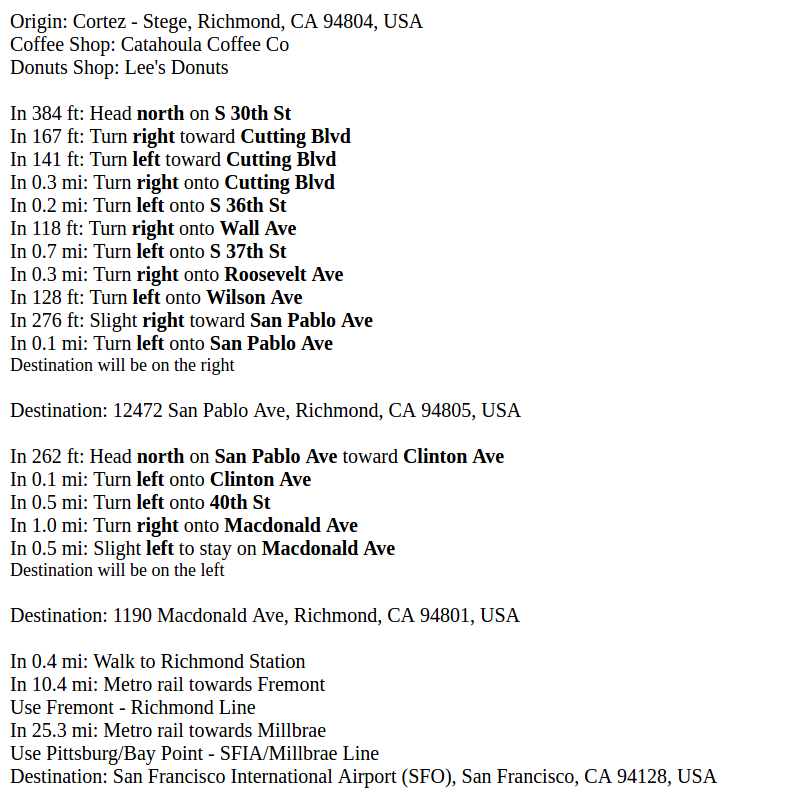

# Step by Step Directions
by David Lin

This application uses Google Maps API to tell you how to get from your current location to the nearest coffee shop, the nearest donuts shop, and then your desired destination. This application queries the user for the mode of transportation, destination, and then opens an HTML page displaying step by step instructions for reaching your destination.

I used the Google Maps Python API, which can be found at:
https://github.com/googlemaps/google-maps-services-python

To run this application, download googlemaps for Python3:
 
$ pip install -U googlemaps

Then, run:
 
$ python directions.py

Example:
 

